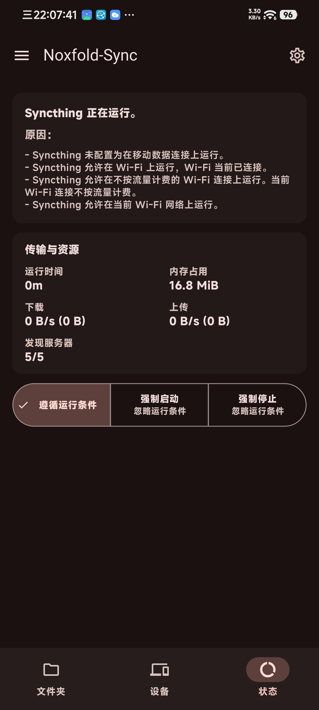
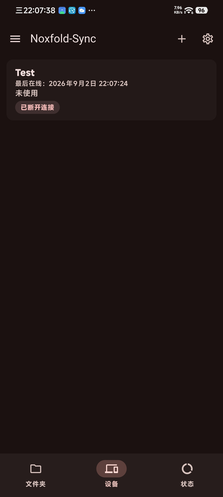
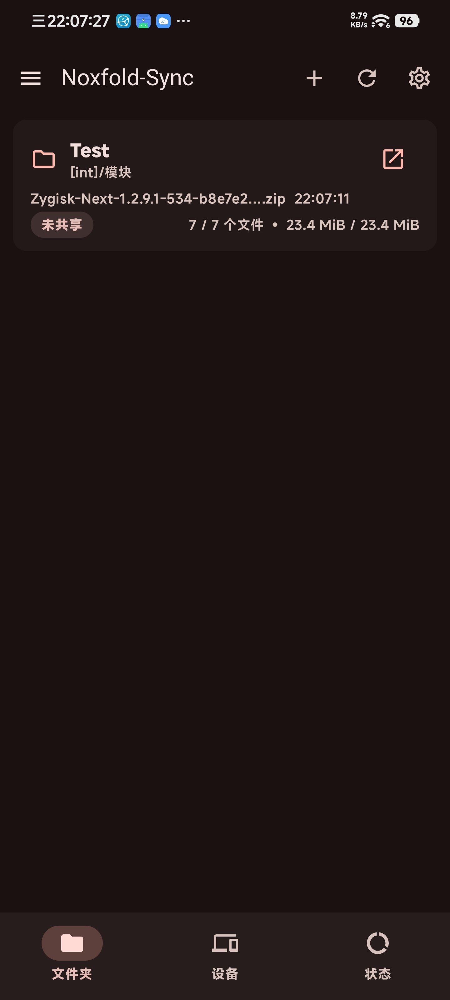

# Syncthing-Fork (Compose Edition)

English | [简体中文](README_zh-CN.md)

[](https://opensource.org/licenses/MPL-2.0)
[](https://github.com/100pangci/syncthing-android/actions/workflows/build-app.yaml)
[](https://github.com/100pangci/syncthing-android/releases/latest)

An Android wrapper for [Syncthing](https://github.com/syncthing/syncthing). The Syncthing core, written in Go, is packaged as `libsyncthingnative.so` and executed as a child process managed by a foreground service, with a native Android UI on top — private, decentralized file syncing across devices, no root required.



## Changes in this Fork

An intensive rewrite on top of [researchxxl/Syncthing-Fork](https://github.com/researchxxl/syncthing-android):

### Full UI Rewrite
- The legacy Java/View UI has been completely rewritten with **Jetpack Compose + Material 3**, using a single-Activity **Navigation 3** architecture
- The folders / devices / status pages moved to a bottom navigation bar
- All legacy View code and resources removed

### New Features
- **SAF bridge**: folders exposed by third-party DocumentsProviders (no real filesystem path, e.g. another app's data root) are bridged into the Syncthing core via an in-app forwarding layer and synced like any other folder
- **Root mode (optional, off by default)**: run the Syncthing core as root to sync any directory — e.g. other apps' data — without any bridging. Toggling the setting asks for su authorization with a confirmation warning; the built-in folder picker gains a root browse mode; app-private files are handed back to the app automatically when root is switched off. See the [root mode guide](wiki/tips-and-tricks/Run-as-root-on-rooted-devices.md)
  - Security note: in root mode the core has root-level filesystem access, so the REST API / Web GUI becomes the only barrier — keep GUI authentication enabled and never expose the GUI port beyond localhost.
- **AMOLED black theme**: follow system / light / dark / AMOLED, switching instantly, with the embedded Web GUI synced to its black theme
- **Full i18n coverage**: all 38 language packs completed to 100% (496 keys + 8 plurals each, including az / be / ckb / gl created from scratch in this fork). Missing keys were filled in with AI assistance; pre-existing human translations were left untouched. zh-CN has additionally been proofread by the maintainer — corrections for any language via PR are welcome.
- Application ID changed to `com.github.ywpc05.syncthingfork` (`ywpc05` is the author's former GitHub username; the current account is `100pangci` — same person, historical naming), so it installs alongside the upstream app

### Service Layer Rewrite
- The service layer is now fully Kotlin + coroutines / Flow (`SyncthingService` / `RestApi` / event polling / run condition monitoring / `ConfigXml` / receivers / quick-settings tiles / TLS trust manager / notification & config helpers) — zero Java left in the app sources. Dagger has been removed in favor of manual DI, and Volley/guava have been replaced by OkHttp/stdlib.

### Stability & Fixes
- Migrated the deprecated `CONNECTIVITY_ACTION` receiver to `NetworkCallback`, and split `SyncthingService` responsibilities into dedicated managers (HTTPS cert, config backup)
- Fixed planned-shutdown SIGKILL (exit code 137) being misreported as a crash, root sessions locking the app out of `config.xml` (0600 root ownership), and stale root cores surviving force-stop; narrowed root `find`/kill scope to this app's sync dirs. See the [release notes](https://github.com/100pangci/syncthing-android/releases) for the full changelog.

### Engineering
- Added Robolectric unit tests for core sync paths (event processing, run conditions, config parsing)
- CI fully takes over: automated debug / release builds with signing

## Download

Grab an APK from [Releases](https://github.com/100pangci/syncthing-android/releases/latest), or subscribe via [Obtainium](https://apps.obtainium.imranr.dev/redirect?r=obtainium%3A%2F%2Fapp%2F%7B%22id%22%3A%22com.github.ywpc05.syncthingfork%22%2C%22url%22%3A%22https%3A%2F%2Fgithub.com%2F100pangci%2Fsyncthing-android%22%2C%22author%22%3A%22100pangci%22%2C%22name%22%3A%22Syncthing-Fork%22%2C%22preferredApkIndex%22%3A0%2C%22additionalSettings%22%3A%22%7B%5C%22verifyLatestTag%5C%22%3Atrue%7D%22%2C%22overrideSource%22%3Anull%7D).

> The application ID is `com.github.ywpc05.syncthingfork` (debug builds get a `.debug` suffix). It differs from both the official app and the upstream `com.github.catfriend1.syncthingfork`, so it installs side by side and **cannot** upgrade either of them in place. To migrate: export `config.zip` in the old app, install this fork, then import it via Settings → Import & Export. See the [migration guide](wiki/migration/Switching-from-the-deprecated-official-version.md) for the step-by-step flow.

### Signature verification

Release APKs are signed in CI with a stable release key (see `common-sign.yaml`; debug APKs use the standard debug key). To verify what you downloaded:

```bash
apksigner verify --print-certs app-*.apk
```

The certificate fingerprint should stay constant across releases. If it ever changes, treat the build as suspect and report it. Obtainium users can additionally enable `verifyLatestTag` (already set in the subscribe link above).

## Known limitations

- Root mode is verified only on a single Magisk / HyperOS device; **KernelSU / APatch are untested** — test reports welcome (device, su implementation, result).
- On Android 16 / HyperOS, implicit broadcasts to `AppConfigReceiver` are blocked — use explicit broadcasts (see wiki).

## Building

```bash
# 0. Clone with the Syncthing core submodule
git clone --recurse-submodules https://github.com/100pangci/syncthing-android
# (already cloned: git submodule update --init --recursive)

# 1. Install prerequisites (SDK / NDK / Go)
python3 scripts/install_minimum_android_sdk_prerequisites.py

# 2. Cross-compile the Syncthing native library
./gradlew buildNative

# 3. Build the app
./gradlew assembleDebug     # or assembleRelease
```

Requires JDK 21 and a recent stable Android Studio (AGP 9.x / `compileSdk 37` track the latest toolchain — update Studio first if the project fails to sync). See [Building and Development](wiki/developers/Building-and-Development.md) for details. CI automatically builds and signs debug / release APKs.

## Docs / Wiki

The knowledge base (FAQ, battery optimization, vendor-specific background restrictions, troubleshooting, etc.) lives in the [wiki](wiki#readme).

## Tech Stack

| Layer | Technologies |
|---|---|
| UI | Kotlin, Jetpack Compose, Material 3, Navigation 3 |
| Service layer | Kotlin + coroutines / Flow (foreground service, REST API, event polling, run condition monitoring, config XML, receivers, quick-settings tiles, notifications & backups) — zero Java |
| Sync core | Syncthing (Go, git submodule), packaged as `libsyncthingnative.so`, executed as a child process of the foreground service |
| DI / data | Manual DI, Gson, OkHttp, SharedPreferences |
| Optional root | libsu (su detection, root shell, storage ownership hand-back) |
| Build | Gradle (Kotlin DSL) + Version Catalog, JDK 21, AGP 9.x |

- minSdk 23 (Android 6.0) / targetSdk 36 / compileSdk 37

## Acknowledgments

- Upstream fork source: [researchxxl/syncthing-android](https://github.com/researchxxl/syncthing-android)
- Former maintainers: [Catfriend1](https://github.com/Catfriend1), [imsodin](https://github.com/imsodin), [nutomic](https://github.com/nutomic)
- The [Syncthing](https://github.com/syncthing/syncthing) core team

## Privacy Policy

See [privacy-policy.md](privacy-policy.md).

## License

[MPLv2](LICENSE)
