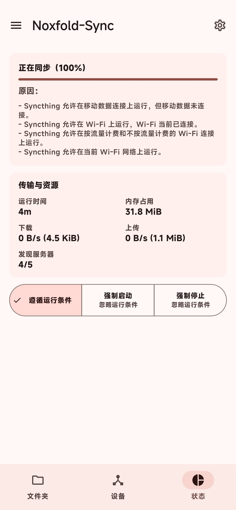
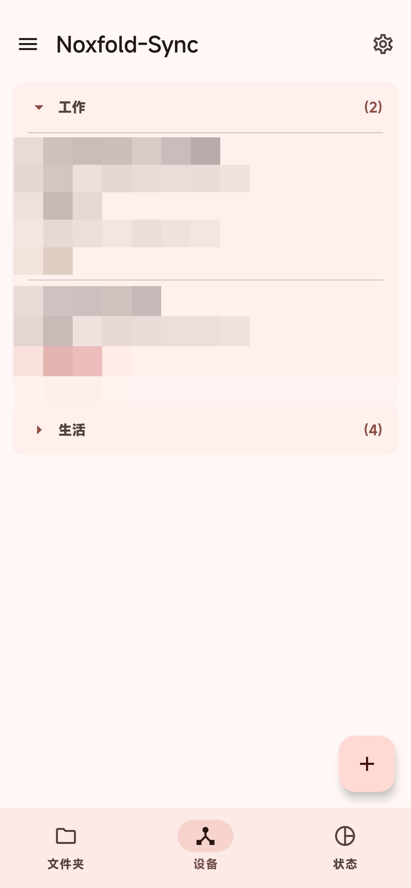
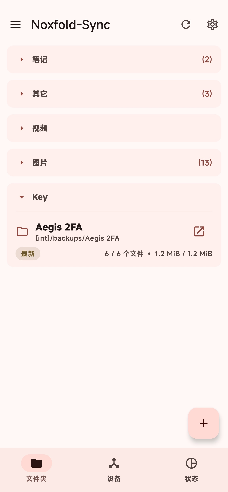
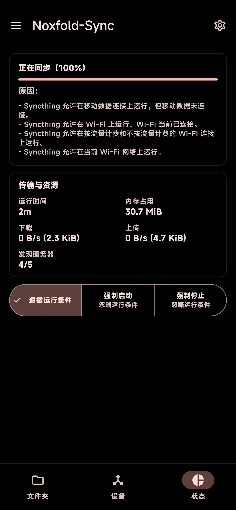
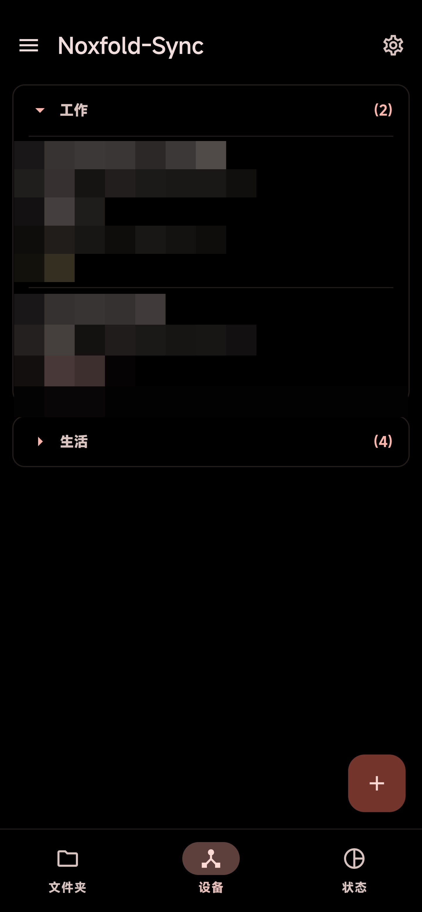
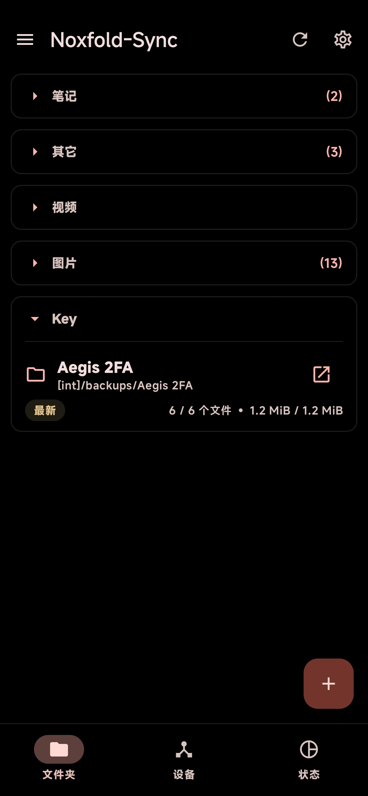

# Noxfold-Sync (Compose 版)

[English](README.md) | 简体中文

[](https://opensource.org/licenses/MPL-2.0)
[](https://github.com/100pangci/Noxfold-Sync/actions/workflows/build-app.yaml)
[](https://github.com/100pangci/Noxfold-Sync/releases/latest)

[Syncthing](https://github.com/syncthing/syncthing) 的 Android 封装。Syncthing 核心以 Go 编写，打包为 `libsyncthingnative.so`、由前台服务以子进程方式拉起运行，上层提供原生 Android 界面，无需 ROOT 即可在多台设备间私密、去中心化地同步文件。

<div align="center">
  <p>
    
    
    
  </p>
  <p>
    
    
    
  </p>
</div>

## 本 Fork 的改动

在 [researchxxl/Syncthing-Fork](https://github.com/researchxxl/syncthing-android)的基础上完成的集中重构：

### 界面全面重构
- 旧 Java/View 界面整体重写为 **Jetpack Compose + Material 3**，采用单 Activity + **Navigation 3** 导航
- 文件夹 / 设备 / 状态三个页面迁移到底部导航栏
- 移除全部旧 View 遗留代码与资源

### 新特性
- **SAF 桥接**：第三方 DocumentsProvider 提供的虚拟文件夹（无真实文件路径，如其他应用的数据根目录）通过应用内转发桥接入 Syncthing 核心，与普通文件夹一样同步
- **Root 模式（可选，默认关闭）**：以 root 身份运行 Syncthing 核心，可直接同步任意目录（如其他应用的数据），无需任何桥接。开关打开时请求 su 授权并弹窗确认；内置目录选择器提供 Root 浏览模式；关闭 root 时自动把应用私有文件的所有权交还给应用。详见 [root 模式说明](wiki/tips-and-tricks/Run-as-root-on-rooted-devices.md)
  - 安全提醒：root 模式下核心拥有 root 级文件系统访问权限，REST API / Web GUI 成了唯一防线——请保持 GUI 鉴权开启，不要把 GUI 端口暴露到 localhost 之外。
- **AMOLED 纯黑主题**：跟随系统 / 浅色 / 深色 / AMOLED 四档即时切换，同步内嵌 Web GUI 的 black 主题
- **全量本地化补全**：38 种语言全部补齐至 100%（每种含 496 键 + 8 组复数，其中 az / be / ckb / gl 为本 fork 从零新建）。缺失的键由 AI 补全，原有人工翻译未做改动；简体中文已由维护者重新校对——欢迎为任何语言提 PR 指正。
- 包名改为 `com.github.ywpc05.syncthingfork`（`ywpc05` 是作者的旧 GitHub 用户名，现账号为 `100pangci`，系同一人，属历史命名），可与上游版本并存安装

### 服务层重写
- 服务层已全部迁移为 Kotlin + 协程 / Flow（`SyncthingService` / `RestApi` / 事件轮询 / 运行条件监视 / `ConfigXml` / 广播接收器 / 快捷设置磁贴 / TLS 信任管理器 / 通知与配置辅助类）——应用源码零 Java。Dagger 已移除，改为手动 DI；Volley/guava 已替换为 OkHttp/标准库。

### 稳定性与修复
- 废弃的 `CONNECTIVITY_ACTION` 广播接收迁移到 `NetworkCallback`，`SyncthingService` 职责拆分到专职管理器（HTTPS 证书、配置备份）
- 修复计划内关停的 SIGKILL（退出码 137）被误报为崩溃、root 会话把 `config.xml` 锁成 0600 属主致应用侧无法读写、强停后 root 残留核心等问题；root 下 `find`/kill 范围收窄到本应用同步目录。完整更新日志见 [release notes](https://github.com/100pangci/Noxfold-Sync/releases)。

### 工程化
- 为核心同步路径（事件处理、运行条件、配置解析）补充 Robolectric 单元测试
- CI 完整接管：自动构建 debug / release 并签名

## 下载

前往 [Releases](https://github.com/100pangci/Noxfold-Sync/releases/latest) 下载 APK，或使用 [Obtainium](https://apps.obtainium.imranr.dev/redirect?r=obtainium%3A%2F%2Fapp%2F%7B%22id%22%3A%22com.github.ywpc05.syncthingfork%22%2C%22url%22%3A%22https%3A%2F%2Fgithub.com%2F100pangci%2FNoxfold-Sync%22%2C%22author%22%3A%22100pangci%22%2C%22name%22%3A%22Noxfold-Sync%22%2C%22preferredApkIndex%22%3A0%2C%22additionalSettings%22%3A%22%7B%5C%22verifyLatestTag%5C%22%3Atrue%7D%22%2C%22overrideSource%22%3Anull%7D) 订阅更新。

> 应用包名为 `com.github.ywpc05.syncthingfork`（debug 构建带 `.debug` 后缀），与官方版、上游 `com.github.catfriend1.syncthingfork` 均不同，可并存安装，**无法**在它们基础上原地升级。迁移方法：旧应用内导出 `config.zip`，装好本 fork 后在「设置 → 导入导出」中导入。分步流程见[迁移指南](wiki/migration/Switching-from-the-deprecated-official-version.md)。

### 签名校验

release APK 由 CI 用固定 release 密钥签名（见 `common-sign.yaml`；debug 包用标准 debug 密钥）。校验下载包：

```bash
apksigner verify --print-certs app-*.apk
```

证书指纹在各版本间应保持不变；若发生变化请视为可疑并上报。Obtainium 用户可额外开启 `verifyLatestTag`（上方订阅链接已默认带上）。

## 已知限制

- Root 模式仅在单台 Magisk / HyperOS 设备验证过；**KernelSU / APatch 未测试**——欢迎反馈测试结果（机型、su 方案、结果）。
- Android 16 / HyperOS 会拦截发往 `AppConfigReceiver` 的隐式广播，请用显式广播（见 wiki）。

## 构建

```bash
# 0. 连同 Syncthing 核心子模块一起克隆
git clone --recurse-submodules https://github.com/100pangci/Noxfold-Sync
# （已 clone 过：git submodule update --init --recursive）

# 1. 安装 SDK / NDK / Go 等前置依赖
python3 scripts/install_minimum_android_sdk_prerequisites.py

# 2. 交叉编译 Syncthing 原生库
./gradlew buildNative

# 3. 构建应用
./gradlew assembleDebug     # 或 assembleRelease
```

需要 JDK 21 和较新的稳定版 Android Studio（AGP 9.x / `compileSdk 37` 跟随最新工具链，同步失败请先升级 Studio）。详细说明见 [Building and Development](wiki/developers/Building-and-Development.md)。CI 会自动构建 debug / release APK 并签名。

## 文档 / Wiki

知识库（常见问题、电池优化、厂商后台限制、故障排除等）见 [wiki](wiki#readme)。

## 技术栈

| 层 | 技术 |
|---|---|
| UI | Kotlin, Jetpack Compose, Material 3, Navigation 3 |
| 服务层 | Kotlin + 协程 / Flow（前台服务、REST API、事件轮询、运行条件监视、配置 XML、广播接收器、快捷设置磁贴、通知与备份）——零 Java |
| 同步核心 | Syncthing (Go, git submodule)，打包为 `libsyncthingnative.so`，以前台服务的子进程方式运行 |
| DI / 数据 | 手动 DI, Gson, OkHttp, SharedPreferences |
| 可选 Root | libsu（su 检测、root shell、存储所有权交还） |
| 构建 | Gradle (Kotlin DSL) + Version Catalog, JDK 21, AGP 9.x |

- minSdk 23 (Android 6.0) / targetSdk 36 / compileSdk 37

## 致谢

- 上游 Fork 源：[researchxxl/syncthing-android](https://github.com/researchxxl/syncthing-android)
- 历史维护者：[Catfriend1](https://github.com/Catfriend1)、[imsodin](https://github.com/imsodin)、[nutomic](https://github.com/nutomic)
- [Syncthing](https://github.com/syncthing/syncthing) 核心团队

## 隐私政策

见 [privacy-policy.md](privacy-policy.md)。

## 许可证

[MPLv2](LICENSE)
